# GNU开发环境安装

本文档介绍 B6x SDK GNU开发所需的完整工具链安装步骤, 以Windows操作系统为例.

## 环境要求

| 组件     | 最低版本 |
|----------|----------|
| VSCode   | 最新版   |
| ARM GCC  | 14.2 *** 强制指定版本 ***    |
| CMake    | 3.20+    |
| Ninja    | 最新版   |

---
*** 注意安装前确认工具是否已经安装并检查版本是否满足当前环境要求 *** 

## 1. [VSCode](https://code.visualstudio.com) 编辑器

### 1.1 下载与安装

1. [下载](https://code.visualstudio.com/Download)

   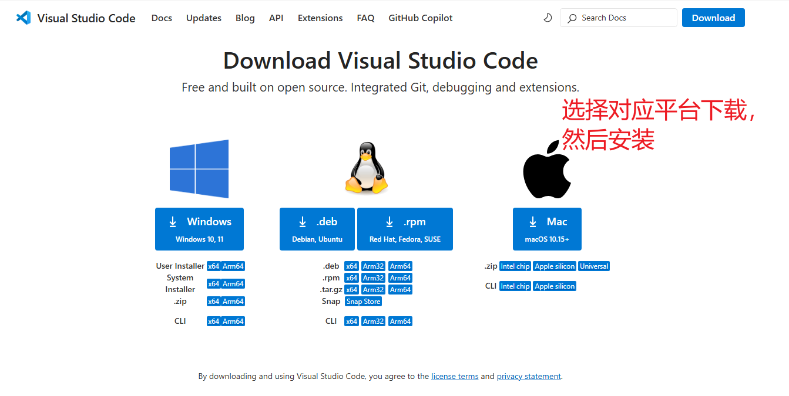

2. 安装时勾选以下选项：
   - 添加到 PATH
   - 添加"通过 Code 打开"到右键菜单

### 1.2 安装插件

安装以下插件以获得最佳开发体验：

| 插件名称 | 用途 |
| ------- | ---- |
| **C/C++** (Microsoft) | C/C++ 语言支持、IntelliSense |
| **C/C++ Extension Pack** | C/C++ 开发工具集 |
| **CMake Tools** (Microsoft) | CMake 构建支持 |
| **Cortex-Debug** | ARM Cortex 调试支持 |
| **ARM Assembly** | ARM 汇编语法高亮 |

**安装方法**：

1. 打开 VSCode
2. 按 `Ctrl+Shift+X` 打开扩展面板
3. 搜索插件名称并点击安装

## 2. ARM 交叉编译工具链

### [Arm GNU Toolchain](https://developer.arm.com/downloads/-/arm-gnu-toolchain-downloads)

选择对应的 PC 平台下载交叉编译工具链（强制要求 14.2 版本）。

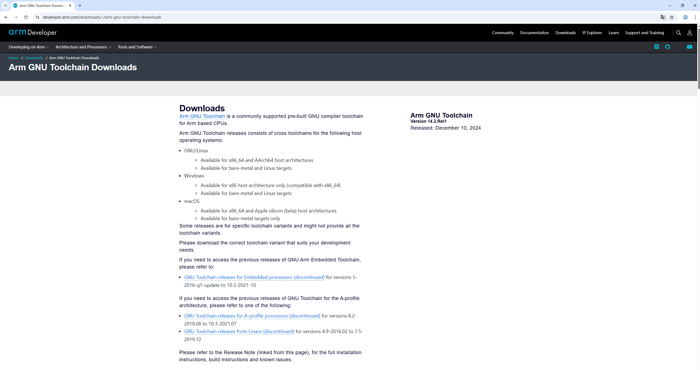

### 2.1 下载

选择以下之一：

- **强制版本要求**：[.exe 安装版本 Windows (mingw-w64-x86_64)](https://developer.arm.com/-/media/Files/downloads/gnu/14.2.rel1/binrel/arm-gnu-toolchain-14.2.rel1-mingw-w64-x86_64-arm-none-eabi.exe)
*** 注意工具版本，强制为14.2.rel1 版本 ***

### 2.2 安装

**安装版本**：

1. 双击运行 `.exe` 文件
2. 选择安装路径（建议使用默认路径或不含中文/空格的路径）
3. 勾选 "Add path to environment variable" 选项

### 2.3 验证安装

打开命令行或终端执行：

```bash
arm-none-eabi-gcc --version
```

成功输出示例：

```bash
arm-none-eabi-gcc (Arm GNU Toolchain 14.2.Rel1 (Build arm-14.52)) 14.2.0
Copyright (C) 2024 Free Software Foundation, Inc.
```

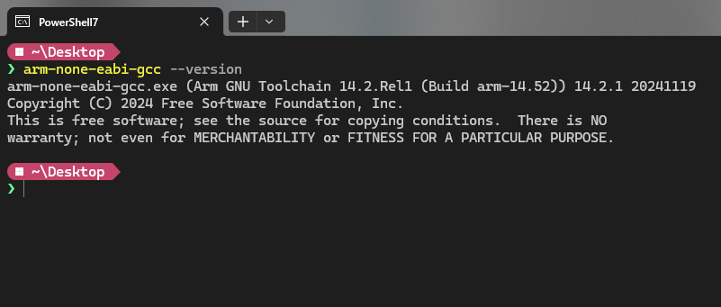

> **注意**：如果提示"命令未找到"，请重启终端或检查 PATH 环境变量是否正确配置。

## 3. 构建工具 (CMake + Ninja)

### 3.1 CMake 下载

[下载连接](https://github.com/Kitware/CMake/releases/download/v4.3.0-rc3/cmake-4.3.0-rc3-windows-x86_64.msi) - 选择 Windows x64 Installer

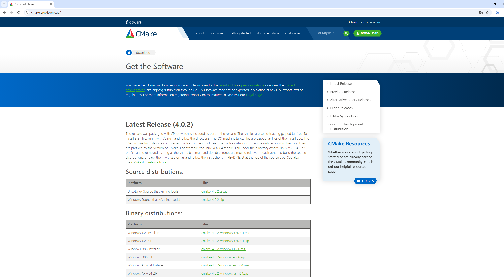

### 3.2 CMake 安装

**安装版本**：

1. 运行 `.msi` 安装程序
2. 重要：在安装界面选择 **"Add CMake to the system PATH for all users"**

### 3.3 CMake 验证安装

```bash
cmake --version
```

输出示例：

```bash
cmake version 4.3.0
CMake suite maintained and supported by Kitware (kitware.com/CMake).
```

#### 3.5 Ninja下载

[下载 Latest 版本](https://github.com/ninja-build/ninja/releases/download/v1.13.2/ninja-win.zip) - 选择 `ninja-win.zip`

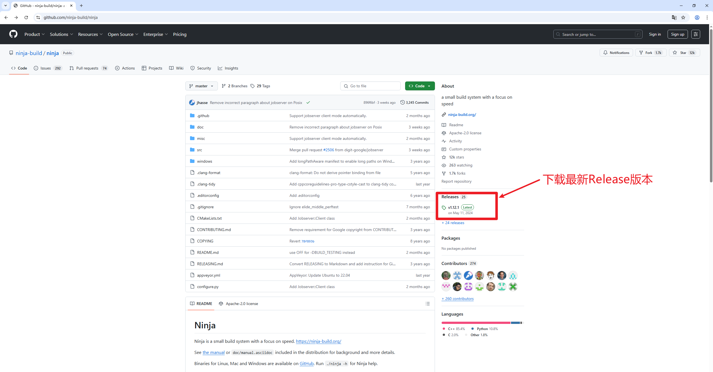

#### 3.6 Ninja 安装

1. 解压 `ninja-win.zip` 得到 `ninja.exe`
2. 将 `ninja.exe` 放到已加入 PATH 的目录，或添加其所在目录到 PATH

推荐的目录：

- `C:\Program Files\ninja\`
- 或与 CMake 同目录

#### 3.7 Ninja 验证安装

```bash
ninja --version
```

输出示例：

```bash
1.12.1
```

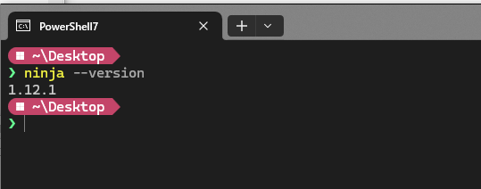

---

## 4. J-Link 调试器

J-Link 用于固件下载和在线调试。

### 4.1 下载

[SEGGER J-Link 下载页面](https://www.segger.com/downloads/jlink/)

### 4.2 安装

1. 下载并运行 J-Link 安装程序
2. 选择安装组件（默认即可）
3. 安装完成后，J-Link 相关工具会自动加入 PATH

验证安装
```bash
JLink.exe
SEGGER J-Link Commander V7.58 (Compiled Nov  4 2021 16:29:29)
DLL version V7.58, compiled Nov  4 2021 16:28:06
```
*** 注意：验证失败需要手动配置PATH环境变量 ***

### 4.3 安装 B6x 设备支持

J-Link 默认不支持 B6x 芯片，需要安装设备支持文件。

详见：[JFlash配置说明](../JFlash配置说明.docx)

### 4.4 CMake Tools 使用

安装 **CMake Tools** 插件后，可在 VSCode 中直接管理 CMake 项目。
双击打开SDK 根目录下文件 sdk6.code-workspace， 你可以看到整个工程。

#### 基本操作

| 操作 | 快捷键 | 说明 |
| ---- | ------ | ---- |
| 选择 Kit | - | 选择编译器工具链 (arm-none-eabi-gcc) |
| 配置 | `F1` → `CMake: Configure` | 生成构建文件 |
| 构建 | `F7` | 编译当前目标 |
| 构建全部 | `Ctrl+Shift+B` | 编译所有目标 |
| 清理 | `F1` → `CMake: Clean` | 清理构建产物 |
| 选择启动目标 | - | 选择调试用的可执行文件 |

#### 状态栏说明

VSCode 底部状态栏显示 CMake 相关按钮：

```text
[Kit: GCC...] [Build] [Target: bleUart ▼] [Debug] [Launch]
```

- **Kit**: 当前选择的工具链
- **Build**: 点击构建
- **Target**: 点击选择启动目标（调试时使用的 ELF 文件）
- **Debug/Launch**: 启动调试

#### 首次配置步骤

**步骤 1**: 打开 SDK 目录，CMake Tools 自动检测 `CMakeLists.txt`, 选择 Kit(指定编译器).

点击状态栏 `[No Kit Selected]` 或按 `Ctrl+Shift+P` → `CMake: Select a Kit`

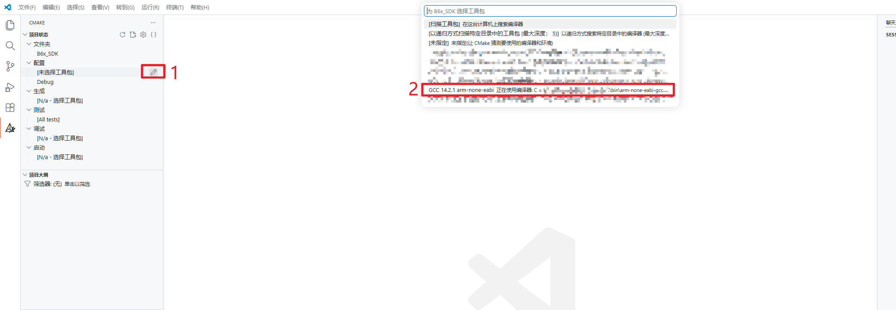

**步骤 2**: 选择 配置类型Debug/Release. **Debug模式可以jLink调试.**

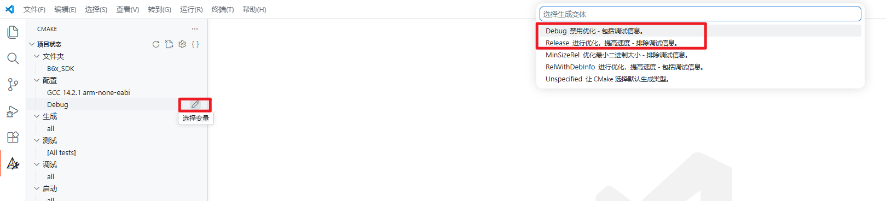

**步骤 3**: 配置项目. 如果没有自动配置选择`清理所有项目并重新配置`

`Ctrl+Shift+P` → `CMake: Configure`

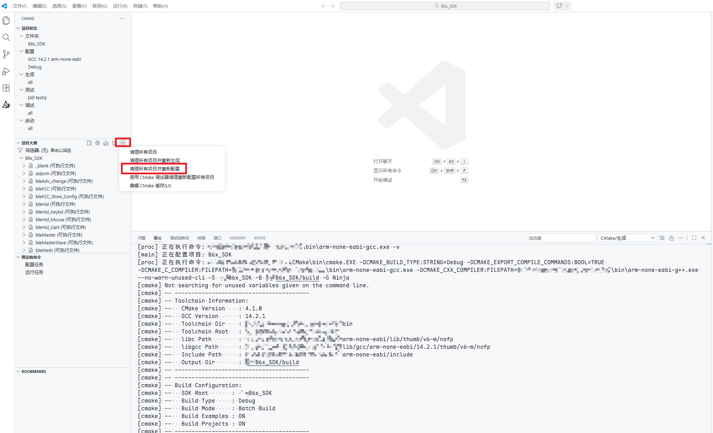

**步骤 4**: 构建

生成指定项目 或 all.

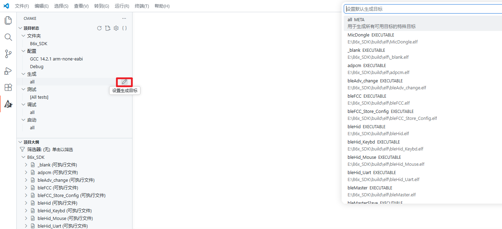

按 `F7` 或点击状态栏 `[Build]`

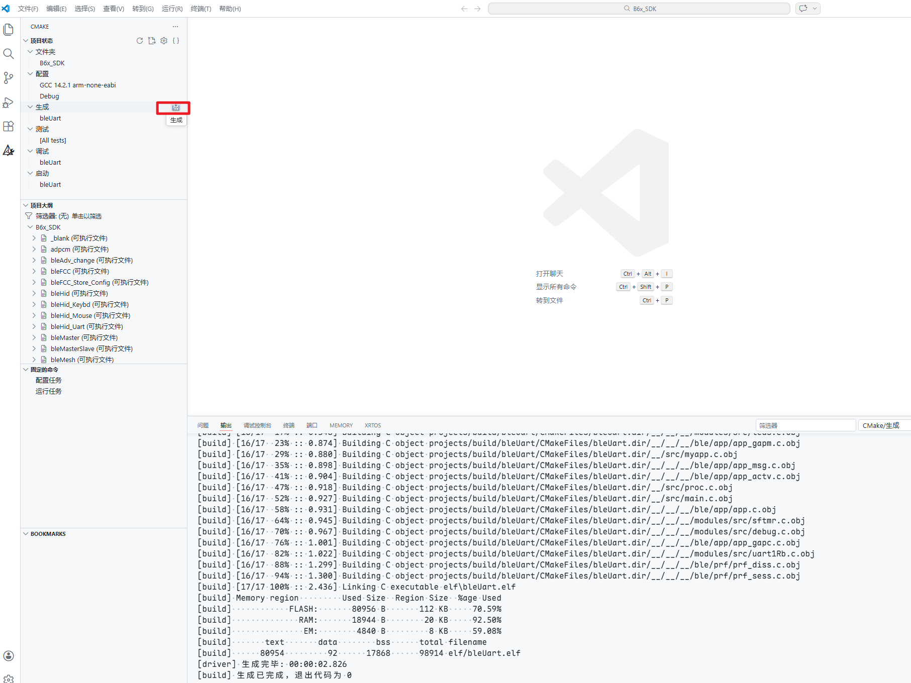

**步骤 5**: 选择目标

点击状态栏 `[Target]` 选择要调试的项目

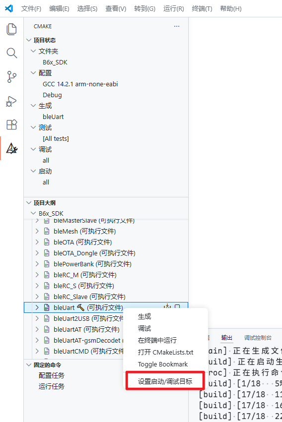

### 4.5 VSCode 调试配置

安装 **Cortex-Debug** 插件后，参考 `.vscode/launch.json` 中配置：

---

## 5. 环境变量配置

### 5.1 检查 PATH

确保以下路径已添加到系统 PATH（示例路径，请**根据实际安装位置调整**）：

```text
C:\Program Files\Microsoft VS Code\bin
C:\Program Files (x86)\Arm GNU Toolchain Arm Embedded\14.2 Rel1\bin
C:\Program Files\CMake\bin
C:\Program Files\ninja
C:\Program Files\SEGGER\JLink
```

### 5.2 配置方法

1. 右键"此电脑" → "属性" → "高级系统设置"
2. 点击"环境变量"
3. 在"系统变量"中找到 `Path`，点击"编辑"
4. 点击"新建"，添加上述路径

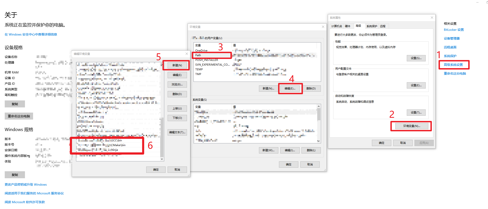

---

## 6. 命令行手动构建测试

克隆或解压 SDK 后，执行以下命令验证编译环境：

```bash
# 进入 SDK 目录
cd sdk6

# 生成构建文件
cmake -B build -G Ninja

# 编译所有示例
cmake --build build
```

编译成功后，`build/` 目录下会生成：

- `elf/*.elf` - ELF 可执行文件
- `hex/*.hex` - Intel HEX 烧录文件
- `bin/*.bin` - 二进制镜像
- `map/*.map` - 内存映射文件

---

## 7. 常见问题

### Q1: `arm-none-eabi-gcc` 命令未找到

**原因**：PATH 未正确配置或终端未刷新

**解决**：

1. 确认工具链 `bin` 目录已添加到 PATH
2. 关闭并重新打开终端/命令行窗口
3. 或重启电脑使环境变量生效

### Q2: CMake 找不到 Ninja

**错误信息**：

`CMake Error: CMake was unable to find a build program corresponding to "Ninja"`

**解决**：

1. 确认 `ninja.exe` 所在目录已加入 PATH
2. 或在 CMake 命令中指定：`-DCMAKE_MAKE_PROGRAM=/path/to/ninja.exe`

### Q3: 编译报错 `stdio.h` 未找到

**原因**：ARM GCC 工具链安装不完整

**解决**：

1. 重新安装 ARM GNU Toolchain
2. 确保安装时选择了所有组件

### Q4: J-Link 连接失败

**解决**：

1. 检查 J-Link 驱动是否正确安装
2. 确认设备管理器中 J-Link 已识别
3. 检查 SWD 接线是否正确

### Q5: VSCode C/C++ IntelliSense 不工作

**解决**：

1. 确保已安装 C/C++ 插件
2. 打开命令面板 (`Ctrl+Shift+P`)，执行 `C/C++: Edit Configurations`
3. 添加 ARM GCC 的 include 路径到配置中
