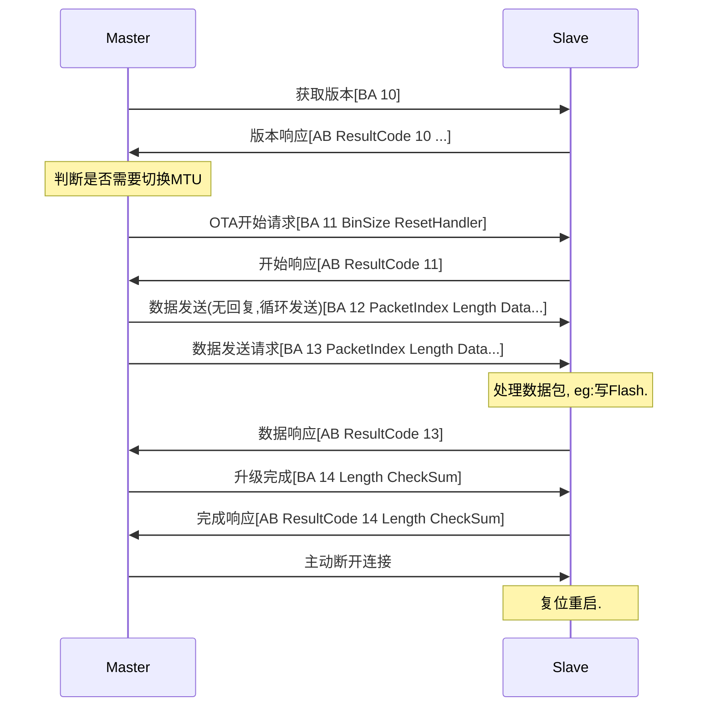
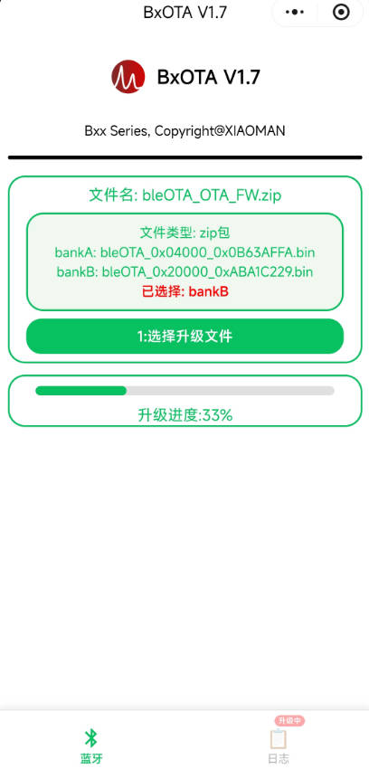

# BxOTA V1.7

## OTA方式

支持2种方式: 通过**CFG_USE_LOAD**宏定义控制.

- **使用loader模式**(examples\loader)时bankB只存储, 只需要更新bankA, 复位后通过loader搬到bankA.
- **不使用loader模式**时, 当前运行在bankA时需要更新bankB, 反之当前运行bankB时需要使用bankA.

## OTA Profile 128bits UUID

- **service UUID**: 584db6b8-ce89-72cd-9edf-2162ce8fcabf
- **notify UUID**: 584d09c5-ce89-72cd-9edf-2162ce8fcabf
- **write UUID**: 584d0f42-ce89-72cd-9edf-2162ce8fcabf

```c
/// Characteristic Base UUID128
#define OTA_BASE_UUID128(uuid)     {0xBF, 0xCA, 0x8F, 0xCE, 0x62, 0x21, 0xDF, 0x9E, 0xCD, 0x72, 0x89, 0xCE, ((uuid >> 0) & 0xFF), ((uuid >> 8) & 0xFF), 0x4D, 0x58}

const uint8_t ota_svc_uuid[]  = OTA_BASE_UUID128(0xB6B8);
/// OTA Notify UUID128(Slave -> Master)
const uint8_t ota_char_ntf[]  = OTA_BASE_UUID128(0x09C5);
/// OTA Receive Write Command UUID128(Master -> Slave)
const uint8_t ota_char_recv[] = OTA_BASE_UUID128(0x0F42);
```

## OTA协议

### 基本格式

```text
Master->Slave: BA Flag XXXX
Slave->Master: AB ResultCode Flag XXXX
```

**先交互获取BuckSize和PacketMaxLen, Master将整个bin文件按照BuckSize分块，每个BuckSize块按照PacketMaxLen分包，
BuckSize块数据先通过BA 12命令分包发送, 每个BuckSize块最后一包通过BA 13命令发送, PacketIndex从0开始每发一包数据递增1.**

#### 1. 获取协议版本

| 方向 | Header | ResultCode | Flag | 其它字段 |
| --- | --- | --- | --- | --- |
| Master→Slave | 0xBA | - | 0x10 | - |
| Slave→Master | 0xAB | 0x00/0x01 | 0x10 | 版本号(1), BuckSize(2), PacketMaxLen(2) |

#### 2. OTA开始

| 方向 | Header | ResultCode | Flag | BinSize(4) | Reset_Handler(4) |
| --- | --- | --- | --- | --- | --- |
| Master→Slave | 0xBA | - | 0x11 | 0xXX 0xYY 0xZZ 0xLL | 0xAA 0xBB 0xCC 0xDD |
| Slave→Master | 0xAB | 0x00/0x01 | 0x11 | - | - |

#### 3. Buck数据发送1

| 方向 | Header | Flag | PacketIndex(2) | Length(2) | DataPayload(n) | 备注 |
| --- | --- | --- | --- | --- | --- | --- |
| Master→Slave | 0xBA | 0x12 | 0xXX 0xXX | 0xXX 0xXX | 0xXX… | 无回复 |

#### 4. Buck数据发送2

| 方向 | Header | ResultCode | Flag | PacketIndex(2) | Length(2) | DataPayload(n) |
| --- | --- | --- | --- | --- | --- | --- |
| Master→Slave | 0xBA | - | 0x13 | 0xXX 0xXX | 0xXX 0xXX | 0xXX… |
| Slave→Master | 0xAB | 0x00/0x01 | 0x13 | - | - | - |

#### 5. OTA结束

| 方向 | Header | ResultCode | Flag | Length(4) | CheckSum(4) |
| --- | --- | --- | --- | --- | --- |
| Master→Slave | 0xBA | - | 0x14 | Bin数据长度 | 累加求和 |
| Slave→Master | 0xAB | 0x00/0x01 | 0x14 | Bin数据长度 | 累加求和 |

#### 6. 结果代码(ResultCode)

| ResultCode | 含义 |
| --- | --- |
| 0x00 | 成功 |
| 0x01 | 错误 |

## OTA数据交互示例



## OTA小程序


## OTA小程序使用示例

- **CFG_USE_LOAD == 1**使用loader方式, 直接选**bin文件**即可.
- **CFG_USE_LOAD == 0**不使用loader方式, 推荐使用**zip压缩包**, 会根据协议版本自动选择bin文件.


