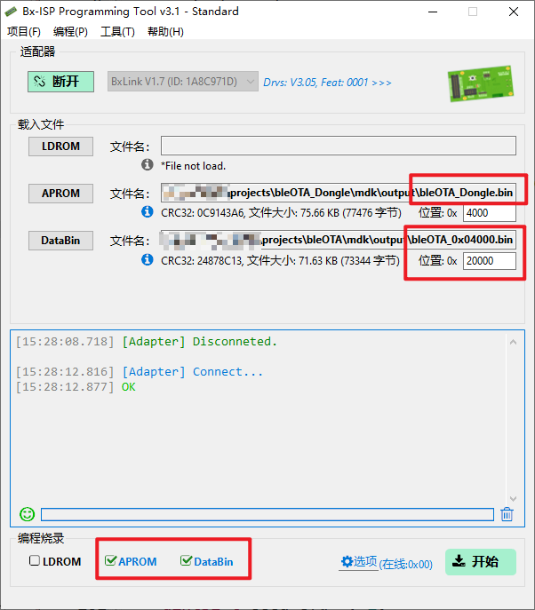

# 指令(Hex 小端序)

## 基本格式

```c
cmd(1B) + len(1B) + data(nB)
```

### 设置扫描广播名称, 默认"BXOTA-"

```c
 A5 LL(1+n) yy(1B) zz(nB) [LL是1(yy)+zz的长度, yy是zz的长度]
```

### 设置扫描持续时间, 默认500ms, 扫描结束如果设置自动连接会再次发起扫描

```c
A6 01 yy(1B) [yy单位是100ms, 0表示持续扫描]
```

### 指定地址发起连接, 清除自动连接

```c
A7 07 xxxxxxxxxxxx(6B) yy(1B) [xx是slave地址, yy是地址类型]
```

### 设置自动连接

```c
A8 01 xx(1B) [xx: 00扫描到不连接, 01扫描到直接连接]
```

### 断开当前连接, 清除自动连接

```c
A9 00
```

## 烧录示例


